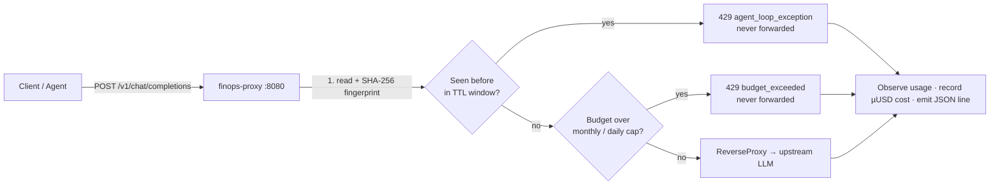

# finops-proxy

[](https://go.dev/dl/)
[](LICENSE)
[](https://github.com/adaleks/finops-proxy/actions/workflows/ci.yml)
[](#zero-dependencies)

**Ultra-Fast, Zero-Dependency LLM Circuit Breaker & Agent Loop Killer.**

A single static Go binary you drop in front of any OpenAI-, Anthropic-, DeepSeek-, or Ollama-compatible endpoint. It fingerprints every request, answers `429 agent_loop_exception` the moment an agent starts repeating itself, and hard-stops spend at per-key and global budget caps — before either burns through your infrastructure bill. No database required, no SaaS dependency, fully offline.

- **Protects against [OWASP LLM04: Unbounded Consumption](https://genai.owasp.org/llmrisk/llm04-unbounded-consumption/)** — infinite loops and unconstrained token spend.
- **Sub-millisecond** per request on the hot path; SHA-256 fingerprinting + an in-memory sliding window.
- **Zero mandatory dependencies** — runs from memory or a single SQLite file (pure-Go, no CGO).
- **Apache-2.0** — the whole engine is open source.

---

## ⚡ Quick start (3 minutes, fully offline)

Requires [Docker](https://docs.docker.com/get-docker/) — nothing else. No network, no SaaS:

```bash
git clone https://github.com/adaleks/finops-proxy.git
cd finops-proxy
docker compose up --build -d
```

This brings up the proxy on `:8080` in front of a dev-only mock LLM upstream, with loop detection and per-key budgets pre-seeded (keys: `sk-loop` = unlimited, `sk-budget` = 1 µUSD/day). Verify it's alive, then fire the same request twice:

```bash
curl -s http://localhost:8080/healthz        # {"status":"ok"}

# First request → 200, forwarded upstream
curl -s -o /dev/null -w "%{http_code}\n" -X POST http://localhost:8080/v1/chat/completions \
  -H 'Content-Type: application/json' -H 'X-FinOps-API-Key: sk-loop' -H 'X-FinOps-Agent-Id: demo' \
  -d '{"model":"gpt-4o","messages":[{"role":"user","content":"hello"}]}'
# 200

# Repeat the identical request → the circuit breaker trips, never forwarded
curl -s -X POST http://localhost:8080/v1/chat/completions \
  -H 'Content-Type: application/json' -H 'X-FinOps-API-Key: sk-loop' -H 'X-FinOps-Agent-Id: demo' \
  -d '{"model":"gpt-4o","messages":[{"role":"user","content":"hello"}]}'
# {"error":{"type":"agent_loop_exception","code":"agent_loop_exception","retry_after":...}}
```

Open the embedded dashboard at **http://localhost:8080/dashboard** to watch blocks and spend live.

To point at a real model instead of the mock, set `FINOPS_UPSTREAM` (see [Configuration](#configuration)):

```bash
FINOPS_UPSTREAM=http://localhost:11434/v1 docker compose up --build -d   # local Ollama
FINOPS_UPSTREAM=https://api.openai.com/v1 docker compose up --build -d   # OpenAI
```

> The mock upstream and the pre-seeded keys are dev-only. In production, swap `FINOPS_UPSTREAM` for your real endpoint and replace `keys.example.json` with your own keys file (`FINOPS_KEYS_PATH`).

---

## Run without Docker

Requires Go 1.22+:

```bash
go build -o bin/finops-proxy ./cmd/proxy

./bin/finops-proxy \
  -upstream http://localhost:11434/v1 \
  -pricing config/pricing.json
```

`config/pricing.json` is required at startup — it is the guaranteed price seed. With no `-db` flag the proxy keeps everything in memory.

### Recover a looping CLI agent with `finops-run`

`finops-run` runs a CLI agent as a child, watches its output for the proxy's `agent_loop_exception` 429, and on detection kills it, clears its proxy history, and restarts it with a recovery prompt:

```bash
go build -o bin/finops-run ./cmd/finops-run

./bin/finops-run \
  -proxy-url http://localhost:8080 \
  -max-restarts 3 \
  -recovery-prompt "Loop detected on previous file, try an alternative solution." \
  ./my-agent --task "implement the feature"
```

`finops-run` flags precede the child binary; everything after it is passed through untouched. Run `finops-run -h` for the full list (`-agent-id`, `-proxy-url`, `-max-restarts`, `-recovery-prompt`, `-retry-on-nonzero`, `-watch`, `-version`).

---

## What it protects against

### 1. Infinite agent loops (OWASP LLM04)

Every non-empty `POST` body is hashed (SHA-256) and checked against a per-agent sliding window. The **first** sighting always passes; the **N-th repeat** within the TTL window is answered `429` and **never forwarded upstream** — so a stuck agent that retries a failing prompt a thousand times costs you one request, not a thousand.

- Fingerprints expire after a configurable TTL (`-ttl`, default `5m`).
- History is scoped per agent via the `X-FinOps-Agent-Id` header, so one agent's loop never blocks another.
- The `429` carries `retry_after` (seconds until the window clears) and the saved-cost estimate of what you avoided spending.
- `DELETE /v1/agent/{id}/history` clears an agent's history (used by the [`finops-run`](cmd/finops-run) CLI wrapper).

Beyond byte-exact repeats, three **deterministic, non-LLM** detectors catch the loops exact hashing misses (enable with `-dynamic`, or individually with `-structural` / `-tool-loop` / `-velocity`):

| Detector | Catches | Example |
|---|---|---|
| Structural (MinHash) | the same prompt with a few dynamic fields changed each turn | `{"attempt":1,…}` then `{"attempt":2,…}` |
| Tool-cycle | a repeating tool-call cycle | `A → B → A → B` |
| Velocity | abnormal token-consumption spikes | a runaway burst of huge prompts |

### 2. Unbounded token spend

Budgets are enforced in integer micro-dollars (µUSD), read from the live request log (never a stale counter):

| Scope | Cap | Enforced by |
|---|---|---|
| Per API key | monthly + daily | `-keys` file (`monthly_budget_micro`, `daily_budget_micro`) |
| Global | daily | `-daily-budget-micro` |

An exhausted budget answers `429 budget_exceeded` with a `retry_after` pointing at the next window, and the request is **not** forwarded. A budget of `0` means unlimited.

### 3. Cost observability

Every forwarded (and blocked) request is recorded with its model, token counts, and µUSD cost, and emitted as one line of JSON to stdout — so you can pipe it into any log pipeline.

---

## How it works



```
                    ┌─────────────────────────────────────────────┐
   client ──POST──▶ │  proxy  (pkg/proxy)                         │
                    │  1. read + hash body (SHA-256)              │
                    │  2. circuit breaker: seen before in window? │──429 agent_loop_exception
                    │  3. budget gate: over monthly/daily cap?    │──429 budget_exceeded
                    │  4. forward via httputil.ReverseProxy       │──▶ upstream LLM
                    │  5. observe usage, record cost, emit JSON   │
                    └─────────────────────────────────────────────┘
```

- **Streaming-safe**: responses pass through unbuffered (`FlushInterval = -1`), so SSE/chat streaming is unaffected.
- **Fail-open**: an oversized body or a read failure never wedges the proxy; budget reads that error fail open rather than blocking traffic.

---

## Performance

Measured with `go test -bench=. -benchmem ./pkg/circuitbreaker/` (Go 1.22, Linux; CI re-records these on every run):

| Hot-path component | ns/op | allocs/op |
|---|---:|---:|
| Payload normalization | ~1 160 | 0 |
| Structural MinHash (fuzzy near-duplicate) | ~15 950 | 0 |
| Tool-cycle matcher | ~4 300 | 6* |
| Token-velocity breaker | ~200 | 0 |
| **Full pipeline (all four detectors)** | **~21 450 (~21 µs)** | **6*** |

The full four-detector pipeline runs in **~21 µs per request — about 47× under the 1 ms budget**.

\* The tool-cycle path's 6 allocations are pooled-buffer bookkeeping on the roadmap to zero; it does not affect the sub-millisecond guarantee.

---

## Zero dependencies

The exported `pkg/` core — `pkg/circuitbreaker`, `pkg/proxy`, `pkg/pricing`, `pkg/logstream` — imports **only the Go standard library**. This is enforced in CI by a `go list -deps` gate.

The optional on-disk store (`internal/store/sqlite`) uses a pure-Go SQLite driver (no CGO); the default in-memory store is stdlib-only. There are no third-party SaaS SDKs, no external API calls, and no embedding providers anywhere in the core.

---

## Architecture

The core is a small, dependency-free Go module. Enterprise concerns are deliberately absent — they live in a separate `finops-proxy-ee` module that imports this one.

```
finops-proxy/
├── pkg/
│   ├── proxy/            # the circuit-breaker reverse-proxy engine + its seams
│   ├── circuitbreaker/   # loop detection: exact hash + structural/tool-cycle/velocity
│   ├── pricing/          # token-cost math + static/remote price table
│   └── logstream/        # transport-agnostic pub/sub log hub
├── internal/
│   ├── store/            # in-memory + SQLite reference stores (core tables only)
│   ├── logging/          # JSON-lines stdout notifier/logger
│   └── wrapper/          # the finops-run loop-recovery CLI wrapper
├── cmd/
│   ├── proxy/            # the engine binary
│   ├── mockserver/       # dev mock LLM upstream
│   └── finops-run/       # CLI child wrapper that kills + recovers looping agents
└── config/pricing.json   # static price seed (required)
```

The engine depends only on the seams it declares (`RequestLogStore`, `BudgetLedger`, `Notifier`, `CallerStore`, …). The enterprise edition supplies the real implementations — multi-tenant hierarchy, SSO/session auth, Slack/Teams webhooks, PostgreSQL/ClickHouse drivers — without ever forking the engine.

### Open-source core vs. Enterprise edition

The core is everything deterministic, stdlib-only, single-node, offline, and < 1 ms on the hot path. Everything semantic, multi-tenant, SaaS-integrated, or exporter-based lives in `finops-proxy-ee`.

| In the open-source core (`finops-proxy`, Apache-2.0) | Enterprise edition (`finops-proxy-ee`) only |
|---|---|
| In-line reverse proxy (`/v1/chat/completions`) for OpenAI, Anthropic, DeepSeek, Ollama | Multi-tenant hierarchy (Company → Department → Team → User) |
| Loop detection — exact hash + deterministic non-LLM heuristics: **MinHash structural**, **tool-cycle**, **token velocity** | Semantic / vector loop detection (embeddings similarity) |
| Budget controls — global + per-API-key monthly/daily caps | Enterprise SSO (SAML 2.0, OAuth2, LDAP, Active Directory) |
| Storage — in-memory / SQLite | PostgreSQL, ClickHouse, OpenTelemetry exporters |
| Observability — JSON logs to stdout, in-process `/v1/metrics`, single-node read-only embedded `/dashboard` | Multi-tenant dashboard, Slack / Microsoft Teams webhook alerting |
| Recovery — `finops-run` CLI kills + restarts a looping child with a recovery prompt | Session auth, RBAC, i18n, PDF reports |

---

## Configuration

All options are CLI flags (the binary does not read env vars):

| Flag | Default | Description |
|---|---|---|
| `-addr` | `:8080` | Listen address |
| `-upstream` | `http://localhost:11434/v1` | Upstream LLM API base URL |
| `-ttl` | `5m` | Loop-detection fingerprint TTL window |
| `-limit` | `2` | Repeat threshold before blocking (`1` = block on first repeat) |
| `-dynamic` | `false` | Enable all dynamic loop detectors (structural + tool-cycle + velocity) |
| `-structural` | `false` | Enable structural near-duplicate loop detection |
| `-tool-loop` | `false` | Enable tool-cycle loop detection |
| `-velocity` | `false` | Enable token-velocity loop detection |
| `-pricing` | `config/pricing.json` | Static price table (required) |
| `-pricing-url` | `""` | Remote catalog endpoint (empty = static-only) |
| `-db` | `""` | SQLite path (empty = in-memory store) |
| `-keys` | `""` | JSON keys file (empty = auth + per-key budgets disabled) |
| `-daily-budget-micro` | `0` | Global daily budget in µUSD (`0` = disabled) |
| `-budget-thresholds` | `50,80,100` | Daily budget alert thresholds (%) |
| `-metrics` | `true` | Expose the `/v1/metrics` JSON observability endpoint |
| `-dashboard` | `true` | Expose the embedded `/dashboard` web UI |
| `-version` | — | Print version and exit |

### Keys file (`-keys`)

```json
[
  {
    "key": "sk-my-secret-key",
    "id": "team-data-science",
    "name": "Data Science",
    "monthly_budget_micro": 50000000,
    "daily_budget_micro": 5000000
  }
]
```

Only the SHA-256 hash of each key is kept in memory — raw keys are never stored. When `-keys` is set, requests must send the key in the `X-FinOps-API-Key` header (stripped before forwarding).

### Proxy-internal headers

These are consumed and **stripped** before the request reaches upstream:

- `X-FinOps-Agent-Id` — scopes loop history per agent.
- `X-FinOps-Project` — scopes cost accounting per project.
- `X-FinOps-API-Key` — authenticates the caller (never forwarded).

---

## API reference

| Route | Method | Description |
|---|---|---|
| `/v1/chat/completions` | `POST` | Proxied request — loop-checked, budget-checked, cost-recorded |
| `/v1/agent/{id}/history` | `DELETE` | Clear an agent's loop history (204) |
| `/v1/metrics` | `GET` | Live in-process metrics (active requests, loop blocks, saved µUSD, latency) |
| `/dashboard` | `GET` | Embedded single-page developer dashboard (polls `/v1/metrics`) |
| `/healthz` | `GET` | Liveness probe → `{"status":"ok"}` |

All other non-empty `POST` bodies are loop-checked and proxied through to `-upstream`.

---

## JSON logging

Every event is one line of JSON on stdout, ready for `jq` or any log shipper:

```json
{"type":"request.complete","level":"info","timestamp":1725400000,"tenant_id":"team-data-science","agent_id":"demo","model":"gpt-4o","prompt_tokens":14,"completion_tokens":128,"cost_micro_usd":3412,"status_code":200}
{"type":"loop_blocked","level":"warn","timestamp":1725400001,"agent_id":"demo","model":"gpt-4o","saved_cost_micro_usd":875,"status_code":429,"first_block":true}
{"type":"budget_exceeded","level":"error","timestamp":1725400002,"tenant_id":"team-data-science","spent_micro_usd":50000000,"monthly_budget_micro":50000000,"retry_after":86400}
```

---

## Contributing

Contributions are welcome — see [CONTRIBUTING.md](CONTRIBUTING.md) for the architecture rules (zero external dependencies in `pkg/`, < 1 ms hot path, offline-first) and the pull-request checklist.

## License

[Apache 2.0](LICENSE). Use it, embed it, ship it — just keep the notice.
