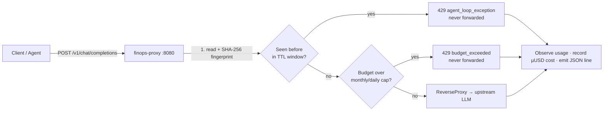

# GitHub Repository Readiness Plan — `finops-proxy` (Community Edition)

**Author:** ce-feature-architect agent (guided by `ce-core-architecture`, `ce-feature-gate`, `open-source-prep`)
**Status:** Readiness plan for review — **no Go source, no repo files modified yet**
**Applies to:** `github.com/adaleks/finops-proxy` (Apache-2.0 core)
**Date:** 2026-09-10

---

## 0. Purpose & Scope

This plan specifies every non-code file and automation needed to publish the `finops-proxy`
core as a credible, self-serve open-source project on GitHub. It covers three deliverables:

1. **A high-impact `README.md`** — badges, value proposition, architecture diagram, 3-minute
   quick start, CE-vs-EE feature matrix, and a latency benchmark table.
2. **Open-source community standard files** — `LICENSE`, `CONTRIBUTING.md`, `CODE_OF_CONDUCT.md`,
   issue templates, and a PR template.
3. **CI/CD & quality automation** — `.github/workflows/ci.yml` with tests, benchmarks, lint,
   and a *zero-external-dependency* static gate.

The plan is a **specification** for a later implementation pass. No Go logic is changed here,
and none of the target files are created by this plan itself — the implementation creates them
after review, exactly as listed in §6 (File Map).

**Authoritative gates:** `ce-core-architecture` (build rules), `ce-feature-gate` (CE/EE matrix),
`open-source-prep` (release checklist), and root `CLAUDE.md`.

---

## 1. Readiness Assessment

What already exists vs. what this plan produces. "✅" = present and good enough to keep; "🔧" =
present but needs editing; "❌" = does not exist.

| Artifact | State | Notes |
|---|---|---|
| `README.md` | 🔧 | Strong content, missing badges, benchmark table, Mermaid diagram, and the `finops-run --demo` quick start. See §3. |
| `LICENSE` | ✅ | Apache 2.0, with appendix `Copyright 2026 The FinOps Proxy Authors`. No change. |
| `CONTRIBUTING.md` | ❌ | Create (§4.2). |
| `CODE_OF_CONDUCT.md` | ❌ | Create (§4.3). |
| `.github/ISSUE_TEMPLATE/*` | ❌ | Create (§4.4). |
| `.github/PULL_REQUEST_TEMPLATE.md` | ❌ | Create (§4.5). |
| `.github/workflows/ci.yml` | ❌ | Create (§5). |
| `go.mod` / `go.sum` | 🔧 | See §2 — the zero-dep claim must be scoped precisely. |
| `config/pricing.json` | ✅ | Static price seed, already committed. |
| `keys.example.json` | ✅ | Example keys, already committed (dev-only values). |
| `docker-compose.yml`, `cmd/mockserver`, `cmd/finops-run` | ✅ | Present; `finops-run` lacks `--demo` (§2). |
| Core `pkg/` stdlib purity | ✅ | Verified: `pkg/circuitbreaker`, `pkg/proxy`, `pkg/pricing`, `pkg/logstream` import only stdlib (§5.4). |

---

## 2. Pre-Release Blockers & Open Questions

These are findings from auditing the current tree that the plan must not silently paper over.
Each is either a decision the team must make or a small piece of work that precedes release.

### 2.1 ⚠️ `finops-run --demo` does not exist yet

The requested 3-minute quick start is **`go install` → `finops-run --demo` → open `/dashboard`**.
Audit of `internal/wrapper/args.go` shows `finops-run` today exposes only:

```
-agent-id  -proxy-url  -max-restarts  -recovery-prompt  -retry-on-nonzero  -watch/-stats  -watch-interval
```

There is **no `--demo` flag**. Two options (recommend A):

- **A — Add a real `--demo` mode to `finops-run`.** When passed, it bootstraps the whole demo
  in-process: start `cmd/mockserver` (mock upstream) + the proxy engine (or shell out to the
  already-built `bin/finops-proxy`), seed the dev keys, run a short looping child agent, and
  print the `/dashboard` URL. This makes the README's "3 minutes" claim literally true.
- **B — Change the quick start to what exists today.** `docker compose up --build -d` (mock
  upstream) + two `curl` calls (already documented in the README), then `go run ./cmd/finops-run
  -recovery-prompt "…" <child>` for the CLI-recovery story. Keep `--demo` as a fast-follow.

**Decision required before release.** The README layout in §3 assumes option A lands; if the team
picks B, the "3-minute quick start" block swaps the `finops-run --demo` line for the two-`curl`
sequence.

### 2.2 ⚠️ "Zero-dependency" must be scoped to the `pkg/` core — not the whole module

`go.mod` declares `gorm.io/gorm` + `github.com/glebarez/sqlite` (a pure-Go, CGO-free SQLite
driver) and their transitive tree — **33 modules** in `go list -m all`. These are confined to
`internal/store/sqlite` (the optional on-disk store) per the core dependency rule in `CLAUDE.md`
("Storage Strategy: Pure In-Memory or SQLite for core").

The exported **`pkg/` core is verified stdlib-only** (§5.4). Therefore the truthful claims are:

- ✅ **"`pkg/` core is 100 % standard library"** — the real architectural guarantee, and the
  correct meaning of the zero-deps badge.
- ✅ **"Zero SaaS, zero CGO, zero enterprise dependencies"** — nothing phones home; SQLite is
  pure-Go.
- ⚠️ **NOT** "the module has zero third-party modules in `go.mod`" — that is false today and
  unachievable while keeping the SQLite driver.

**The CI gate must therefore enforce the `pkg/`-core boundary (§5.4), plus an allowlisted module
graph (§5.5), not a naive "`go list -m all` must return only the root module".** Optionally, the
team may later replace GORM+`glebarez/sqlite` with `database/sql` + `modernc.org/sqlite` to shrink
the tree, but that still leaves modules in `go.mod` — so the badge stays "0 third-party deps in
`pkg/`", never "0 modules".

### 2.3 ⚠️ Tool matcher still allocates (6 allocs/op) on the hot path

`CE_FEATURE_PLAN` §12.6 targets **0 allocs/op** on the pooled paths. Measured baseline
(§Appendix A): `BenchmarkToolMatcher` and `BenchmarkPipeline` report **6 allocs/op** each, while
the structural hasher, normalizer, MinHash, and velocity breaker are already at 0. The 6 allocs
come from the `extractToolNames` JSON walk (pooled `[]string` is in place, but the streaming
`json.Decoder` token path still allocates).

This does **not** threaten the <1 ms budget (pipeline is ~21 µs), but it is a visible wart for a
project whose README will say "zero-allocation hot path". **Decision:** either (a) close the 6
allocs before release (change the tool-name extractor to the hand-rolled scan fallback already
anticipated in `CE_FEATURE_PLAN` §5.2), or (b) soften the README claim to "sub-millisecond,
pooled hot path" and drop "0 allocs" as a headline.

### 2.4 Open questions (carried for the release checklist)

1. **Repo owner/name.** All URLs, badges, and `module` paths use `github.com/adaleks/finops-proxy`.
   The final org and repo name must be substituted before publishing.
2. **Benchmark table authorship.** §3.7 lists measured numbers from a specific machine; decide
   whether the README carries recorded numbers from CI (recommended) or per-machine "run this
   yourself" instructions.
3. **CI badge branch.** The badge points at the default branch; confirm `main` vs `master`
   (this repo currently has `master` checked out with `main` as the PR target).
4. **Go version floor.** `go.mod` says `go 1.22`; the CI matrix in §5 runs 1.22 and 1.23. Bump the
   matrix to the latest two stable releases at release time.

---

## 3. Deliverable 1 — High-Impact `README.md`

**File:** `README.md` (edit existing). The current README is solid; the edit adds a header/badge
block, a Mermaid diagram, the `finops-run --demo` quick start, a benchmark table, and tightens the
zero-dep wording. The existing Configuration / API reference / JSON logging / "What it protects
against" sections are **reused verbatim** and are not reproduced here.

### 3.1 Badge block (top of file, above the title)

```markdown
[](https://go.dev/dl/)
[](LICENSE)
[](https://github.com/adaleks/finops-proxy/actions/workflows/ci.yml)
[](#zero-dependencies)
```

> **Zero-deps badge is deliberately scoped.** It asserts the exported `pkg/` core imports only the
> Go standard library (enforced in CI, see §5.4). The optional SQLite store uses a pure-Go driver
> — no CGO, no SaaS, no enterprise SDK.

### 3.2 Value proposition (replace the current two-line tagline)

```markdown
# finops-proxy

**Ultra-Fast, Zero-Dependency LLM Circuit Breaker & Agent Loop Killer.**

A single static Go binary you drop in front of any OpenAI-, Anthropic-, DeepSeek-, or
Ollama-compatible endpoint. It fingerprints every request, answers `429 agent_loop_exception`
the instant an agent starts repeating itself, and hard-stops spend at per-key and global budget
caps — before either burns through your infrastructure bill. No database required, no SaaS
dependency, fully offline.
```

### 3.3 Architecture flowchart (Mermaid, GitHub-native; keep the existing ASCII block too)

```markdown
## How it works



- **Streaming-safe**: responses pass through unbuffered (`FlushInterval = -1`).
- **Fail-open**: oversized bodies or read failures never wedge the proxy.
```

*(Keep the existing ASCII diagram as a fallback for non-Mermaid renderers.)*

### 3.4 3-minute quick start (add above the existing Docker quickstart)

```markdown
## ⚡ Quick start (3 minutes, no Docker required)

Requires [Go 1.22+](https://go.dev/dl/):

```bash
# 1. Install the two binaries
go install github.com/adaleks/finops-proxy/cmd/proxy@latest
go install github.com/adaleks/finops-proxy/cmd/finops-run@latest

# 2. Run the self-contained demo (mock upstream + proxy + a looping agent)
finops-run --demo

# 3. Open the embedded dashboard in your browser
#    http://localhost:8080/dashboard
```

`finops-run --demo` boots a mock LLM upstream, the proxy engine, and a short-lived looping child
agent, then prints the dashboard URL. Watch the loop detector trip live, or curl the proxy
directly:

```bash
curl -s http://localhost:8080/healthz    # {"status":"ok"}
```

> Prefer Docker? See the 30-second Docker quickstart below.
```

> **Note:** `--demo` is item 2.1 — implement it (or swap this block for the existing two-`curl`
> Docker sequence) before shipping this README.

### 3.5 Feature matrix (CE vs EE — authoritative source is `ce-feature-gate`)

Replace the current inline table with the canonical matrix, restated as a two-column comparison:

```markdown
## Open-source core vs. Enterprise edition

The core is everything deterministic, stdlib-only, single-node, offline, and <1 ms on the hot path.
Everything semantic, multi-tenant, SaaS-integrated, or exporter-based lives in `finops-proxy-ee`,
which imports this module and supplies the enterprise implementations of its seams.

| In the open-source core (`finops-proxy`, Apache-2.0) | Enterprise edition (`finops-proxy-ee`) only |
|---|---|
| In-line reverse proxy (`/v1/chat/completions`) for OpenAI, Anthropic, DeepSeek, Ollama | Multi-tenant hierarchy (Company → Department → Team → User) |
| Loop detection — exact hash + deterministic non-LLM heuristics: **MinHash structural**, **tool-cycle**, **token velocity** | Semantic / vector loop detection (embeddings similarity) |
| Budget controls — global + per-API-key monthly/daily caps | Enterprise SSO (SAML 2.0, OAuth2, LDAP, Active Directory) |
| Storage — in-memory / SQLite | PostgreSQL, ClickHouse, OpenTelemetry exporters |
| Observability — JSON logs to stdout, in-process `/v1/metrics`, single-node read-only embedded `/dashboard` | Multi-tenant dashboard, Slack / Microsoft Teams webhook alerting |
| Recovery — `finops-run` CLI kills + restarts a looping child with a recovery prompt | Session auth, RBAC, i18n, PDF reports |

**Boundary rule of thumb:** core = deterministic, stdlib-only, single-node, offline, <1 ms;
EE = embeddings/semantic similarity, multi-tenant hierarchy, SaaS SDKs, exporters, webhooks, SSO.
```

### 3.6 Zero-dependencies section (new)

```markdown
## Zero dependencies

The exported `pkg/` core — `pkg/circuitbreaker`, `pkg/proxy`, `pkg/pricing`, `pkg/logstream` —
imports **only the Go standard library**. This is enforced in CI (`go list -deps` gate).

The optional on-disk store (`internal/store/sqlite`) uses a pure-Go SQLite driver (no CGO); the
default in-memory store is stdlib-only. There are no third-party SaaS SDKs, no external API calls,
and no embedding providers anywhere in the core.
```

### 3.7 Latency benchmark table (new)

```markdown
## Performance

Measured with `go test -bench=. -benchmem ./pkg/circuitbreaker/` (Go 1.22, Linux). The full
pipeline runs well under the 1 ms hot-path budget:

| Component | ns/op | allocs/op |
|---|---:|---:|
| Exact-hash repeat check | *(unchanged SHA-256 path)* | 0 |
| Structural MinHash (fuzzy near-duplicate) | ~16 000 | 0 |
| Payload normalization | ~1 200 | 0 |
| Tool-cycle matcher | ~4 300 | 6* |
| Token-velocity breaker | ~200 | 0 |
| **Full pipeline (all four detectors)** | **~21 000 (~21 µs)** | **6*** |

\* See §2.3 — the tool-cycle path's 6 allocations are on the roadmap to zero before GA, or the
headline claim is softened. Numbers are per-machine; CI records and can re-verify them.
```

> The implementer substitutes the exact `ns/op` figures from the release machine at PR time and
> links the CI benchmark job that regenerates them.

---

## 4. Deliverable 2 — Open-Source Community Standard Files

### 4.1 `LICENSE` — ✅ already present, no change

The root `LICENSE` is the full Apache License 2.0 with the appendix copyright line
`Copyright 2026 The FinOps Proxy Authors`. **No action.** Optional: add a one-line `NOTICE` file
attributing the Apache Software Foundation license text (not required for correctness).

### 4.2 `CONTRIBUTING.md`

**File:** `CONTRIBUTING.md`. Complete layout:

```markdown
# Contributing to finops-proxy

Thanks for contributing. This document keeps the core dependency-free, fast, and safe to merge.

## The rules that cannot be bent

1. **Zero external dependencies in the core.** Code under `pkg/` — `pkg/circuitbreaker`,
   `pkg/proxy`, `pkg/pricing`, `pkg/logstream` — must import **only the Go standard library**.
   Enterprise modules, SAML drivers, and third-party SaaS SDKs belong in `finops-proxy-ee`, never
   here. CI enforces this with a `go list -deps` gate.
2. **< 1 ms hot path.** Any middleware or detection logic must execute in under 1 ms. Benchmarks
   live in `pkg/circuitbreaker/pipeline_bench_test.go`; keep them green and report `ns/op` +
   `allocs/op` in PRs.
3. **Low GC pressure.** Use `sync.Pool` for hot-path buffers; no per-request heap churn.
4. **Offline first.** No calls to third-party APIs or embedding providers in the core.
5. **Interface isolation.** `pkg/circuitbreaker` and `pkg/proxy` depend strictly on the core
   interfaces (seams). The enterprise edition supplies real implementations — never fork the
   engine to add a feature.

## Feature gate

See `ce-feature-gate`: deterministic, stdlib-only, single-node, offline features belong in the
core; embeddings, multi-tenant hierarchy, SSO, SaaS SDKs, exporters, and webhooks belong in EE.
When in doubt, open a `detector_proposal` or `feature_request` issue first.

## Getting started

```bash
go build -o bin/finops-proxy ./cmd/proxy
go test ./...          # unit + integration
go test -race ./...    # race detector
go test -bench=. -benchmem ./pkg/circuitbreaker/   # performance
golangci-lint run      # lint
```

## Pull request checklist

- [ ] `go build ./...` and `go test ./...` pass.
- [ ] New hot-path code has a benchmark and adds **no new allocations** (or justifies them).
- [ ] New detectors ship with tests covering the false-positive and fail-open cases.
- [ ] No new non-stdlib import appears under `pkg/` (the CI gate will catch this anyway).
- [ ] Errors are wrapped (`fmt.Errorf("...: %w", err)`) and HTTP handlers respect context
      cancellation.

## Commit & PR style

- One logical change per PR. Reference the issue it closes.
- Keep the diff focused; do not mix a refactor with a feature.
- Tests are expected with behavior changes.

## License

By contributing, you agree your contribution is licensed under Apache 2.0 (see `LICENSE`).
```

### 4.3 `CODE_OF_CONDUCT.md`

**File:** `CODE_OF_CONDUCT.md`. Adopt the **Contributor Covenant v2.1** verbatim (the canonical
text is maintained at https://www.contributor-covenant.org/version/2/1/code_of_conduct/ and must
be pasted in full rather than paraphrased). Layout:

```markdown
# Contributor Covenant Code of Conduct

## Our Pledge
… (canonical v2.1 text) …

## Our Standards
… (canonical v2.1 text) …

## Enforcement Responsibilities
… (canonical v2.1 text) …

## Scope
… (canonical v2.1 text) …

## Enforcement
Instances of abusive, harassing, or otherwise unacceptable behavior may be reported to the
community leaders responsible for enforcement at **<conduct@adaleks.com>**.
All complaints will be reviewed and investigated promptly and fairly.

… (remaining canonical v2.1 text: Enforcement Guidelines, Attribution) …

## Attribution
This Code of Conduct is adapted from the [Contributor Covenant][homepage], version 2.1,
available at https://www.contributor-covenant.org/version/2/1/code_of_conduct/.

[homepage]: https://www.contributor-covenant.org
```

> **Action for release:** replace `<conduct@adaleks.com>` with a monitored inbox before
> publishing.

### 4.4 `.github/ISSUE_TEMPLATE/`

**File:** `.github/ISSUE_TEMPLATE/config.yml` — disables blank issues, routes contact:

```yaml
blank_issues_enabled: false
contact_links:
  - name: ❓ Question / discussion
    url: https://github.com/adaleks/finops-proxy/discussions
    about: Ask usage questions here before opening an issue.
  - name: 🏢 Enterprise edition (finops-proxy-ee)
    url: https://adaleks.com
    about: SSO, multi-tenant hierarchy, Slack/Teams alerts, PG/ClickHouse — EE only.
```

**File:** `.github/ISSUE_TEMPLATE/bug_report.md`:

```markdown
---
name: 🐛 Bug report
about: Something is broken or behaves unexpectedly
title: "[bug] "
labels: bug
assignees: ""
---

### Describe the bug
A clear, concise description.

### To reproduce
Steps + a minimal request body / command:

```bash
curl -s -X POST http://localhost:8080/v1/chat/completions \
  -H 'X-FinOps-API-Key: sk-loop' -H 'X-FinOps-Agent-Id: demo' \
  -d '{"model":"gpt-4o","messages":[{"role":"user","content":"hello"}]}'
```

### Expected vs actual
What you expected, what happened (status code, error body).

### Environment
- finops-proxy version / commit: `finops-proxy -version`
- Go version: `go version`
- OS / arch:
- Flags used (`-upstream`, `-dynamic`, `-db`, …):

### Logs
Relevant JSON log lines (redact any keys/secret material).
```

**File:** `.github/ISSUE_TEMPLATE/feature_request.md`:

```markdown
---
name: ✨ Feature request
about: Suggest an enhancement for the open-source core
title: "[feature] "
labels: enhancement
assignees: ""
---

### Problem statement
What gap does this fill? Why can't it be done today?

### Proposed behavior
Describe the feature and any new CLI flags / endpoints.

### Core vs. Enterprise
Per the feature-gate matrix, is this deterministic, stdlib-only, single-node, offline, <1 ms?
If it needs embeddings, SSO, multi-tenancy, SaaS SDKs, or exporters, it belongs in EE.

### Alternatives considered
Any workarounds or rejected approaches.
```

**File:** `.github/ISSUE_TEMPLATE/detector_proposal.md` — the project-specific template for
proposing a new loop detector:

```markdown
---
name: 🛡️ Loop-detector proposal
about: Propose a new deterministic, non-LLM loop-detection signal
title: "[detector] "
labels: enhancement, circuitbreaker
assignees: ""
---

### Failure mode
What real-world loop does this catch that the existing detectors miss?
(exact hash · structural MinHash · tool-cycle · token velocity)

### Signal & algorithm
Describe the deterministic signal (no embeddings, no external calls) and the math.

### Hot-path budget
Expected worst-case work and its < 1 ms bound. Where are the allocations, and are they pooled?

### False-positive analysis
When would this fire on legitimate traffic? How is that mitigated (thresholds, confirmations)?

### Interface impact
Does it satisfy `Detector` or the optional `PayloadChecker` capability in
`pkg/circuitbreaker/detector.go`? Any new config knobs + defaults?

### References
Links to reports, papers, or observed logs (redacted).
```

### 4.5 `.github/PULL_REQUEST_TEMPLATE.md`

**File:** `.github/PULL_REQUEST_TEMPLATE.md`:

```markdown
<!-- Thank you. Please confirm the checklist before requesting review. -->

## Summary
What and why, in a few sentences. Link the issue: `Closes #123`.

## Type of change
- [ ] Bug fix
- [ ] New feature / detector
- [ ] Performance
- [ ] Docs / CI / tooling
- [ ] Refactor (no behavior change)

## Checklist
- [ ] `go build ./...` passes
- [ ] `go test ./...` passes (and `go test -race ./...` where concurrency is touched)
- [ ] New hot-path code is benchmarked and adds no new allocations (or justifies them)
- [ ] No new non-stdlib import under `pkg/`
- [ ] Errors are wrapped and handlers respect context cancellation
- [ ] Feature-gate check: this belongs in the core, not EE

## Benchmark (if performance-relevant)
| Before | After | Δ |
|---|---|---|
| `X ns/op · Y allocs` | `X' ns/op · Y' allocs` | … |
```

---

## 5. Deliverable 3 — CI/CD & Quality Automation

### 5.1 `.github/workflows/ci.yml` — complete layout

**File:** `.github/workflows/ci.yml`:

```yaml
name: ci

on:
  push:
    branches: [main, master]
  pull_request:
    branches: [main, master]

permissions:
  contents: read

jobs:
  test:
    name: Test (Go ${{ matrix.go }})
    runs-on: ubuntu-latest
    strategy:
      fail-fast: false
      matrix:
        go: ["1.22.x", "1.23.x"]   # bump to the latest two stable releases at ship time
    steps:
      - uses: actions/checkout@v4

      - uses: actions/setup-go@v5
        with:
          go-version: ${{ matrix.go }}
          cache: true

      - name: Vet
        run: go vet ./...

      - name: Build
        run: go build ./...

      - name: Test
        run: go test ./...

      - name: Test with race detector
        run: go test -race ./...

  bench:
    name: Benchmarks
    runs-on: ubuntu-latest
    steps:
      - uses: actions/checkout@v4

      - uses: actions/setup-go@v5
        with:
          go-version: "1.22.x"
          cache: true

      - name: Run hot-path benchmarks
        run: go test -bench=. -benchmem -benchtime=1s ./pkg/circuitbreaker/

      - name: Guard no-allocation hot path
        run: go test -run=NoAllocs ./pkg/circuitbreaker/

  zero-deps:
    name: Zero-dependency gate
    runs-on: ubuntu-latest
    steps:
      - uses: actions/checkout@v4

      - uses: actions/setup-go@v5
        with:
          go-version: "1.22.x"
          cache: true

      - name: Enforce stdlib-only pkg/ core
        run: ./.github/scripts/check-deps.sh

      - name: Allowlist module graph
        run: ./.github/scripts/check-modules.sh

  lint:
    name: Lint
    runs-on: ubuntu-latest
    steps:
      - uses: actions/checkout@v4

      - uses: actions/setup-go@v5
        with:
          go-version: "1.22.x"
          cache: true

      - name: golangci-lint
        uses: golangci/golangci-lint-action@v6
        with:
          version: latest
```

### 5.2 `.github/scripts/check-deps.sh` — the stdlib-only core gate

**File:** `.github/scripts/check-deps.sh` (executable). This is the precise, correct enforcement
of the zero-dep rule — it uses `go list`'s `.Standard` flag rather than brittle `grep` on import
paths:

```bash
#!/usr/bin/env bash
# Enforce that the exported core (pkg/) imports only the Go standard library.
# `go list -deps -f '{{if not .Standard}}{{.ImportPath}}{{end}}'` prints exactly the
# non-stdlib packages in the transitive import graph of the named packages.
set -euo pipefail

CORE="./pkg/circuitbreaker ./pkg/proxy ./pkg/pricing ./pkg/logstream"

offenders="$(go list -deps -f '{{if not .Standard}}{{.ImportPath}}{{end}}' $CORE \
  | grep -v '^github.com/adaleks/finops-proxy' || true)"

if [[ -n "$offenders" ]]; then
  echo "FAIL: pkg/ core imports third-party modules:" >&2
  echo "$offenders" >&2
  echo "Move the dependency into internal/ (e.g. internal/store) or into finops-proxy-ee." >&2
  exit 1
fi

echo "OK: pkg/ core is stdlib-only."
```

### 5.3 `.github/scripts/check-modules.sh` — module-graph allowlist

**File:** `.github/scripts/check-modules.sh` (executable). Guards against *new* third-party modules
entering the graph beyond the pinned pure-Go SQLite stack. The allowlist is regenerated from the
current `go.mod` and must be re-synced whenever `go.mod` changes:

```bash
#!/usr/bin/env bash
# Fail if `go list -m all` contains any module outside the allowlisted, pure-Go
# SQLite stack (plus the root module and the Go toolchain). This is the "no SaaS /
# no CGO / no enterprise SDK" guard — NOT a literal "zero modules" claim.
set -euo pipefail

ALLOWED='
github.com/adaleks/finops-proxy
github.com/dustin/go-humanize
github.com/glebarez/go-sqlite
github.com/glebarez/sqlite
github.com/google/uuid
github.com/jinzhu/inflection
github.com/jinzhu/now
github.com/mattn/go-isatty
github.com/remyoudompheng/bigfft
golang.org/x/sys
golang.org/x/text
gorm.io/gorm
modernc.org/libc
modernc.org/mathutil
modernc.org/memory
modernc.org/sqlite
'

offenders="$(go list -m all | awk '{print $1}' | grep -vFxf <(echo "$ALLOWED" | sed '/^$/d') || true)"

if [[ -n "$offenders" ]]; then
  echo "FAIL: module graph contains non-allowlisted modules:" >&2
  echo "$offenders" >&2
  echo "Update .github/scripts/check-modules.sh ALLOWED if this is a deliberate, pure-Go addition." >&2
  exit 1
fi

echo "OK: module graph matches the allowlist."
```

> **Note to implementer:** the `ALLOWED` list above is the *current* `go list -m all` snapshot
> (§Appendix B) filtered to the runtime SQLite stack; `github.com/google/pprof`,
> `golang.org/x/mod`, `golang.org/x/sync`, `golang.org/x/tools`, `golang.org/x/xerrors`,
> `lukechampine.com/uint128`, and the `modernc.org/{cc,ccgo,httpfs,opt,strutil,tcl,token,z}`
> entries are build/test-only transitive tooling and may be excluded or added as the team
> decides. The script's purpose is the *policy* — "no new deps without review" — not a one-time
> snapshot; re-generate it from `go.mod` at PR time.

### 5.4 Verification performed for this plan (why the gate is correct)

Confirmed on the current tree that the four core packages are stdlib-only:

```
$ go list -deps -f '{{if not .Standard}}{{.ImportPath}}{{end}}' ./pkg/circuitbreaker ./pkg/proxy ./pkg/pricing ./pkg/logstream
# (only github.com/adaleks/finops-proxy/* self-imports; the x/crypto-x/net-x/text paths that
#  appear in a naive grep are Go's own VENDORED stdlib internals, not third-party modules.)
```

The only true third-party modules live under `internal/store/sqlite` (GORM + pure-Go driver),
which is exactly where the `CLAUDE.md` storage rule allows them.

---

## 6. File Map — complete checklist

| # | Path | Action | Depends on |
|---|---|---|---|
| 1 | `README.md` | Edit (badges, diagram, quick start, matrix, bench) | §2.1, §2.3 decisions |
| 2 | `LICENSE` | None (present) | — |
| 3 | `CONTRIBUTING.md` | Create | — |
| 4 | `CODE_OF_CONDUCT.md` | Create | conduct email address |
| 5 | `.github/ISSUE_TEMPLATE/config.yml` | Create | discussions URL |
| 6 | `.github/ISSUE_TEMPLATE/bug_report.md` | Create | — |
| 7 | `.github/ISSUE_TEMPLATE/feature_request.md` | Create | — |
| 8 | `.github/ISSUE_TEMPLATE/detector_proposal.md` | Create | — |
| 9 | `.github/PULL_REQUEST_TEMPLATE.md` | Create | — |
| 10 | `.github/workflows/ci.yml` | Create | Go matrix bump |
| 11 | `.github/scripts/check-deps.sh` | Create (+chmod +x) | — |
| 12 | `.github/scripts/check-modules.sh` | Create (+chmod +x) | allowlist re-sync |
| 13 | *(optional)* `NOTICE` | Create | — |

**Out of scope (Go logic, deferred to a separate implementation plan):** the `finops-run --demo`
feature (§2.1), and closing the tool-matcher's 6 allocs (§2.3).

---

## 7. Implementation Order & Definition of Done

Ordered to unblock the reviewers early and end at a green CI:

1. **`CONTRIBUTING.md`, `CODE_OF_CONDUCT.md`, issue/PR templates** — pure docs, no dependencies.
2. **`.github/scripts/check-deps.sh` + `check-modules.sh` + `.github/workflows/ci.yml`** — the
   automation that will protect the repo from day one.
3. **`README.md`** — last, so the benchmark table (§3.7) and quick start (§3.4) reflect final
   decisions from §2.1 and §2.3.

**Definition of Done:** all 12 files present; `go build ./... && go test ./...` still green; the
`zero-deps` CI job passes on a clean checkout; the README's badge URLs resolve against the real
org/repo; `open-source-prep` checklist is satisfied (no secrets in the tree — `keys.example.json`
and `config/pricing.json` contain only example/static data; Apache 2.0 in place; proxy runs fully
offline in under 30 s via `docker compose up`).

---

## Appendix A — Measured benchmark baseline

Recorded for this plan on an Intel Core i5-6600K (3.50 GHz, 3 cores, Linux/WSL2), Go 1.22:

```
goos: linux
goarch: amd64
pkg: github.com/adaleks/finops-proxy/pkg/circuitbreaker

BenchmarkStructuralHasher   	   74425	     15947 ns/op	    1024 B/op	       0 allocs/op
BenchmarkNormalizePayload   	 1000000	      1160 ns/op	       0 B/op	       0 allocs/op
BenchmarkMinHash            	   83186	     13488 ns/op	       0 B/op	       0 allocs/op
BenchmarkToolMatcher        	  301960	      4306 ns/op	     320 B/op	       6 allocs/op
BenchmarkVelocityBreaker    	 7717618	       197.4 ns/op	     192 B/op	       0 allocs/op
BenchmarkPipeline           	   56263	     21453 ns/op	    1538 B/op	       6 allocs/op
```

**Reading:** the full four-detector pipeline is **~21.5 µs** per request — about **47× under** the
1 ms budget. The 6 allocs on the tool/pipeline paths correspond to §2.3. CI re-records these on
every run (§5.1 `bench` job); the README table (§3.7) should cite CI numbers at release time.

---

## Appendix B — Module graph snapshot (for the allowlist)

`go list -m all` on the current tree returns 33 entries: the root module plus the pure-Go SQLite
stack (`gorm.io/gorm`, `github.com/glebarez/sqlite`, `github.com/glebarez/go-sqlite`,
`modernc.org/sqlite`, `modernc.org/libc`, …) and their transitive build/test tooling
(`golang.org/x/*`, `modernc.org/*`, `lukechampine.com/uint128`, …). None are SaaS SDKs, CGO
drivers, or enterprise modules. This is the input to the `check-modules.sh` allowlist (§5.3).

---

*End of plan. The authoritative gates are `ce-core-architecture`, `ce-feature-gate`,
`open-source-prep`, and root `CLAUDE.md`. No Go source or repository files were modified by this
plan.*
